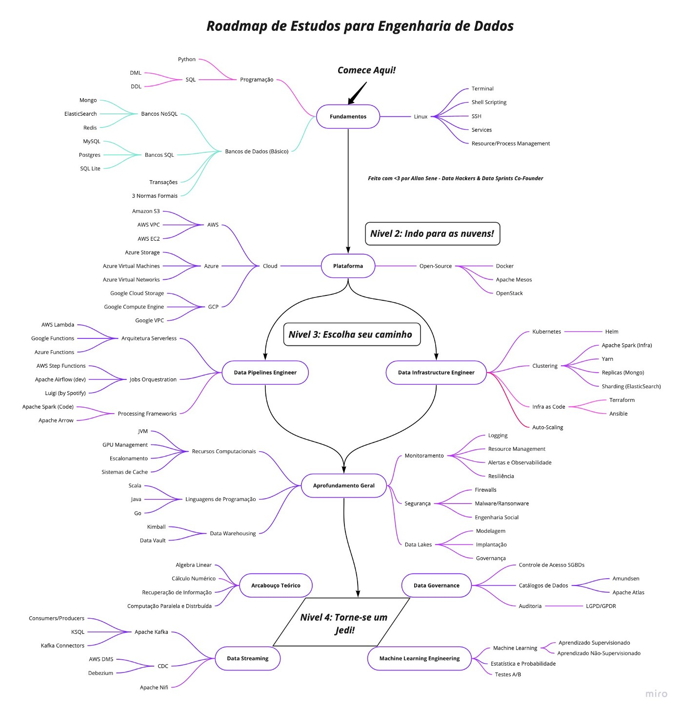

# engenharia_dados_roadmap
Este Roadmap visa fornecer uma visão do cenário de assuntos e tecnologias com a finalidade servir como um guia de estudo para iniciantes em engenharia de dados.
Os dados e conteúdos foram coletados em diversos locais da internet e sendo devidamente creditado.

[Fonte : Data Hackers Um Roadmap de Estudos para se tornar um Engenheiro(a) de Dados](https://medium.com/data-hackers/um-roadmap-de-estudos-para-se-tornar-um-engenheiro-a-de-dados)

Material de Estudo : 

| Grupo | Skills | Links |
|:------|:-------|:------|
| Conceitos | OLTP e OLAP   Business Inteligence   Data Modeling   Data Warehouse   Data Lake   Data Mesh   ETL e ELT | [OLTP e OLAP](https://www.linkedin.com/pulse/explain-example-oltp-vs-olap-michelle-xie/)   [Business Inteligence](https://youtu.be/PoCLfN6sF_8)   [Data Modeling](https://medium.com/sagar-explains-azure-and-analytics-data-engineerin/introduction-to-data-modelling-c0c44432ec0b)   [Data Warehouse](https://www.analytics8.com/blog/data-warehouse-creation-basics/)   [Data Lake](https://faun.pub/an-overview-of-data-lake-concepts-and-architectures-on-aws-and-azure-f485ed5110e2)   [Data Mesh](https://medium.com/data-hackers/data-mesh-indo-al%C3%A9m-do-data-lake-e-data-warehouse-465d57539d89)   [ETL e ELT](https://www.guru99.com/etl-vs-elt.html) |
| Linux | Fundamentos | [LINUXweek: Introdução ao mundo Linux](https://www.youtube.com/watch?v=zGE4UxYndrk&list=PLf-O3X2-mxDnl7LhhjhEgbo2etWKkJ0GV)   [LINUXweek: Descomplicando o Shell no Linux - Guia prático](https://www.youtube.com/watch?v=tkTCZAshOcw&list=PLf-O3X2-mxDnl7LhhjhEgbo2etWKkJ0GV&index=2)  [7 + 3 Comandos que todo mundo deve conhecer no Linux - Linux for beginners!](https://www.youtube.com/watch?v=aJ1rTYrZBq4)   [Saiba o que é SSH (Secure Shell) e pra que serve esse protocolo](https://rockcontent.com/br/blog/ssh/)    [SSH Academy](https://www.ssh.com/academy/ssh) |
| Linguagens de Programação |   Python     R   Scala | [Python](https://www.youtube.com/watch?v=S9uPNppGsGo&list=PLvE-ZAFRgX8hnECDn1v9HNTI71veL3oW0)   [Curso introdutório de Python](https://www.youtube.com/watch?v=yTQDbqmv8Ho)   [Python 3 Module of the Week](https://pymotw.com/3/)    [R](https://www.youtube.com/playlist?list=PLjgj6kdf_snYBkIsWQYcYtUZiDpam7ygg)   [Scala](https://www.youtube.com/playlist?list=PLmtsMNDRU0BxryRX4wiwrTZ661xcp6VPM) |
| Banco de Dados | RDBMS   NoSQL Databases | [O que é SQL e NoSQL? #HipstersPontoTube](https://youtu.be/aure5d3B88g)   [RDBMS](https://medium.com/@asterasoftware1/all-you-need-to-know-about-relational-database-management-systems-rdbmss-4b86dd804bac)   [RDBMS - Postgres](https://www.youtube.com/playlist?list=PLucm8g_ezqNoAkYKXN_zWupyH6hQCAwxY)   [RDBMS - MySQL](https://www.youtube.com/watch?v=Ofktsne-utM&list=PLHz_AreHm4dkBs-795Dsgvau_ekxg8g1r)   [NoSQL Databases](https://medium.com/@mark.rethana/introduction-to-nosql-databases-c5b43f3ca1cc)   [NoSQL Datbases - MongoDB](https://youtu.be/x9tC0eK0GtA)   [NoSQL Databases - Hadoop](https://www.youtube.com/playlist?list=PLeFetwYAi-F_l-NP-TUE2MqKeu_haMP79) |
| Pipelines/ELT/ETL | Orquestradores   Processamento de dados   | [Orquestrador - Airflow](https://youtu.be/f_lnDBR3rFU?t=468)   [Orquestrador - Prefect](https://youtu.be/FETN0iivZps)   [Processamento: Batch vs Stream](https://gowthamy.medium.com/big-data-battle-batch-processing-vs-stream-processing-5d94600d8103)   [Processamento Bacth - Exemplo](https://www.startdataengineering.com/post/update-mysql-in-batch/)   [Processamento Stream - Exemplo](https://www.startdataengineering.com/post/data-engineering-project-for-beginners-stream-edition/) |
| Cloud | Azure | [Princípios básicos do Microsoft Azure](https://docs.microsoft.com/pt-br/learn/paths/az-900-describe-cloud-concepts/)   [Conceitos básicos de dados](https://docs.microsoft.com/pt-br/learn/paths/azure-data-fundamentals-explore-core-data-concepts/)   [Dados relacionais no Azure](https://docs.microsoft.com/pt-br/learn/paths/azure-data-fundamentals-explore-relational-data/)   [Dados não relacionais no Azure](https://docs.microsoft.com/pt-br/learn/paths/azure-data-fundamentals-explore-non-relational-data/)   [Explorar a análise de data warehouse moderna no Azure](https://docs.microsoft.com/pt-br/learn/paths/azure-data-fundamentals-explore-data-warehouse-analytics/) |

